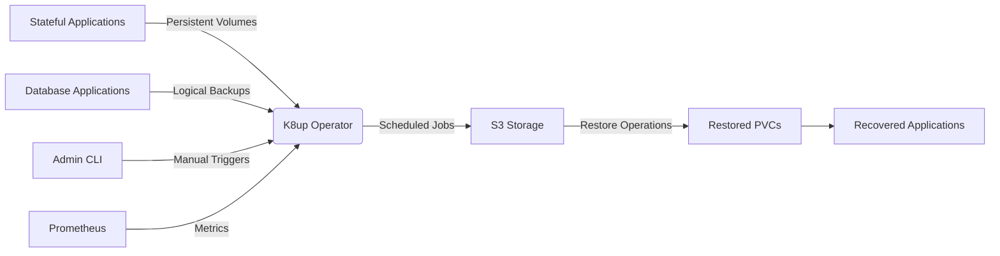

# K8up Backup Operator для Kubernetes

- [K8up Backup Operator для Kubernetes](#k8up-backup-operator-для-kubernetes)
  - [Зачем нужен этот компонент](#зачем-нужен-этот-компонент)
  - [Архитектура](#архитектура)
  - [Особенности реализации](#особенности-реализации)
    - [1. Multi-кластерное развертывание через Fleet](#1-multi-кластерное-развертывание-через-fleet)
    - [2. Отказоустойчивость для production](#2-отказоустойчивость-для-production)
    - [3. Интеграция с корпоративным MinIO](#3-интеграция-с-корпоративным-minio)
  - [Процесс развертывания](#процесс-развертывания)
  - [Базовые концепции](#базовые-концепции)
    - [1. Аннотации для PVC](#1-аннотации-для-pvc)
    - [2. Ресурс Backup](#2-ресурс-backup)
    - [3. Ресурс Restore](#3-ресурс-restore)
  - [Примеры использования](#примеры-использования)
    - [1. StatefulSet с автоматическим бэкапом](#1-statefulset-с-автоматическим-бэкапом)
    - [2. Бэкап базы данных](#2-бэкап-базы-данных)
    - [3. Восстановление после сбоя](#3-восстановление-после-сбоя)
  - [Безопасность](#безопасность)
  - [Troubleshooting](#troubleshooting)
  - [Production-рекомендации](#production-рекомендации)

## Зачем нужен этот компонент

K8up — это **специализированный оператор для резервного копирования и восстановления данных** в Kubernetes-кластерах, решающий критические проблемы enterprise-инфраструктур:

- 💾 Автоматизированное резервное копирование PersistentVolume и StatefulSet приложений
- 🗄️ Интеграция с S3-совместимыми хранилищами (MinIO, AWS S3, OpenStack Swift)
- 🔄 Периодические бэкапы по расписанию с автоматической ротацией
- 🚑 Нативное восстановление отдельных PVC или целых приложений
- 📊 Уведомления и отчеты о статусе бэкапов
- 🛡️ Шифрование данных в транзите и на диске

**Проблемы, которые решает K8up:**

- Потеря данных при отказе storage-системы
- Восстановление после human error (случайное удаление данных)
- Соответствие требованиям регуляторов по резервному копированию
- Восстановление данных в disaster recovery сценариях

## Архитектура



## Особенности реализации

### 1. Multi-кластерное развертывание через Fleet

```yaml
targets:
  - name: management
    clusterSelector:
      matchLabels:
        okbtsp.corp/template: rancher-k3s
  - name: prod
    clusterSelector:
      matchLabels:
        okbtsp.corp/template: talos-vmware
```

### 2. Отказоустойчивость для production

```yaml
replicaCount: 3
tolerations:
  - key: "node-role.kubernetes.io/infra"
    operator: "Equal"
    value: ""
    effect: "NoSchedule"
affinity:
  nodeAffinity:
    requiredDuringSchedulingIgnoredDuringExecution:
      nodeSelectorTerms:
        - matchExpressions:
            - key: node-role.kubernetes.io/infra
              operator: In
              values: [""]
```

### 3. Интеграция с корпоративным MinIO

```yaml
backend:
  repoPasswordSecretRef:
    name: backup-repo
    key: password
  s3:
    endpoint: https://minio.okbtsp.corp/test/ssdfdsf
    accessKeyIDSecretRef:
      name: backup-credentials
      key: username
    secretAccessKeySecretRef:
      name: backup-credentials
      key: password
  tlsOptions:
    caCert: /mnt/ca/ca.crt
```

## Процесс развертывания

1. **Создание Fleet GitRepo**:
   ```bash
   kubectl apply -f gitrepo-dev.yaml  # для dev-среды
   kubectl apply -f gitrepo-master.yaml  # для prod-среды
   ```

## Базовые концепции

### 1. Аннотации для PVC

Для включения автоматического бэкапа PVC достаточно добавить аннотацию:

```yaml
metadata:
  annotations:
    k8up.io/backup: "true"
```

### 2. Ресурс Backup

Определяет правила бэкапа для приложений:

```yaml
apiVersion: k8up.io/v1
kind: Backup
metadata:
  namespace: test
  name: k8up-test-2
spec:
  tags:
    - test
    - dump
    - mariadb
  backend:
    repoPasswordSecretRef:
      name: backup-repo
      key: password
    s3:
      endpoint: https://minio.okbtsp.corp/test/ssdfdsf
```

### 3. Ресурс Restore

Восстанавливает данные в существующий PVC:

```yaml
apiVersion: k8up.io/v1
kind: Restore
metadata:
  namespace: test
  name: restore-csi-test-0
spec:
  restoreMethod:
    folder:
      claimName: data-csi-test-0
```

## Примеры использования

### 1. StatefulSet с автоматическим бэкапом

```yaml
apiVersion: apps/v1
kind: StatefulSet
metadata:
  name: database
spec:
  volumeClaimTemplates:
    - metadata:
        name: data
        annotations:
          k8up.io/backup: "true" # ← автоматический бэкап этого PVC
      spec:
        accessModes: ["ReadWriteOnce"]
        storageClassName: vsphere-csi
        resources:
          requests:
            storage: 10Gi
```

### 2. Бэкап базы данных

```yaml
apiVersion: k8up.io/v1
kind: Backup
metadata:
  name: postgres-backup
spec:
  schedule: "0 2 * * *" # Ежедневно в 2:00
  keepJobs: 24
  backend:
    s3:
      endpoint: https://minio.okbtsp.corp/backups/
  hooks:
    preBackup:
      command: ["/bin/sh", "-c", "pg_dump -U user dbname > /backup/db.sql"]
      container: postgres
```

### 3. Восстановление после сбоя

```bash
# Проверка доступных снапшотов
kubectl exec -n k8up-backups k8up-operator-0 -- k8up restic snapshots

# Создание Restore ресурса
kubectl apply -f restore.yaml

# Проверка статуса восстановления
kubectl get restore -n test restore-csi-test-0 -o jsonpath='{.status.phase}'
```

## Безопасность

- **Шифрование данных**: Все бэкапы шифруются с использованием repoPassword
- **Сегрегация доступа**: Отдельные секреты для разных неймспейсов
- **TLS-шифрование**: Все соединения с S3-хранилищем защищены TLS с корпоративным CA
- **Минимальные привилегии**: ServiceAccount оператора имеет права только на управление PVC и запуск Job'ов

## Troubleshooting

```bash
# Проверка состояния оператора
kubectl get pods -n k8up-backups

# Просмотр логов оператора
kubectl logs -l app.kubernetes.io/name=k8up -n k8up-backups

# Проверка статуса бэкапов
kubectl get backup -A
kubectl get backup -n test k8up-test-2 -o yaml

# Проверка состояния восстановления
kubectl get restore -A
kubectl describe restore -n test restore-csi-test-0

# Доступ к Restic репозиторию для отладки
kubectl exec -it -n k8up-backups k8up-operator-0 -- restic -r s3:https://minio.okbtsp.corp/test/ssdfdsf snapshots
```

## Production-рекомендации

1. **Раздельные хранилища**:

   - Используйте разные S3 buckets для dev/stage/prod сред
   - Настройте lifecycle policies в S3 для автоматического удаления старых бэкапов

2. **Тестирование восстановления**:

   - Регулярно проверяйте возможность восстановления данных
   - Создавайте DR-среду для тестирования полного восстановления кластера

3. **Мониторинг и алертинг**:

   ```yaml
   # Пример алерта Prometheus
   alert: K8upBackupFailed
   expr: k8up_job_status{status="failed"} > 0
   for: 10m
   labels:
     severity: critical
   annotations:
     summary: "K8up backup failed"
     description: "Backup job {{ $labels.job }} failed in namespace {{ $labels.namespace }}"
   ```

4. **Производительность**:

   - Настройте отдельные ноды для выполнения бэкапов, чтобы не нагружать рабочие ноды
   - Используйте сетевые политики для ограничения трафика бэкапов

5. **Соблюдение RPO/RTO**:
   - Для критичных БД настройте частые логические бэкапы
   - Для файловых данных используйте ежедневные полные бэкапы + инкрементальные

> **Важно:** Регулярно тестируйте процесс восстановления данных. Бэкапы бесполезны, если невозможно восстановить данные. Всегда используйте зашифрованные соединения к S3-хранилищу и корпоративные CA-сертификаты вместо self-signed сертификатов.
